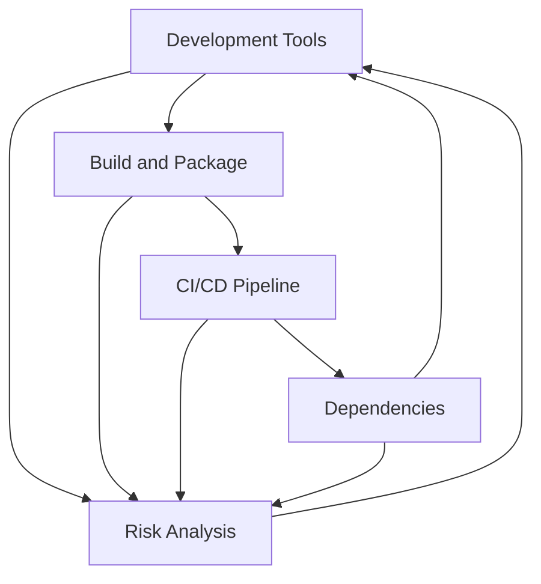

Este repositorio solo contiene este markdown con el material de referencia para una charla de seguridad en el desarrollo de software.

# Código, dependencias y seguridad: donde está el riesgo.
## De que va tratar y no va a tratar esta charla

NO
* Hacking - acércate a tu sombrero blanco más cercano

* Cómo escribir código seguro - valida/sanitiza tus entradas y salidas ([CWE-707](https://cwe.mitre.org/data/definitions/707.html)), aprende cripto, usa OAuth2, etc.
* Linux, Windows, Docker, Kubernetes y todos los otros riesgos de la cadena de suministro donde corre tu código.

* Un pitch de ventas de alguna herramienta en específico 
> *no me pagan lo suficiente*

SI
* Cadena de suministro de software - DEPENDENCY HELL
* Riesgos externos - no todo es tu código
* Análisis de riesgos - entiende mejor tus dependencias

## Que es la cadena de suministro

Si somos obreros de software, la cadena de suministro son las máquinas que nos dan las herramientas y materiales para construir nuestro producto.
a.k.a. Todo lo que no es tu código.
Esto incluye:
* Herramientas de desarrollo (IDE, compiladores, linters)
* Construcción y empaquetado (Maven, Gradle, npm, pip)
* Pipeline de CI/CD (Jenkins, GitHub Actions, GitLab CI)
* Dependencias de código (librerías, frameworks, módulos)

### Ejemplos: Repositorios de paquetes
* Java : [Maven Central](https://mvnrepository.com/repos/central),[mvn download stats](https://dev.to/khmarbaise/analysing-download-statistics-for-apache-maven-3o4o),[top maven packages](https://mvnrepository.com/popular?p=1),[maven vulns](https://security.snyk.io/vuln/maven)
* JavaScript: [npm](https://npmcharts.com/compare/lodash,debug,typescript)
* Python: [PyPI](https://pypistats.org/top)

### Ejemplos: Arboles de dependencias
* [maven-dependency-plugin:tree](https://semgrep.dev/docs/semgrep-supply-chain/setup-maven)
* npm ls --all
* [pip freeze > requirements.txt](https://suyojtamrakar.medium.com/managing-your-requirements-txt-with-pip-tools-in-python-8d07d9dfa464)

## Explotando (muy literal) la cadena de suministro
El gobierno israelí, infiltró la cadena de suministro de Hezbollah en 2024 en los beeper y posteriormente los walkie talkies de sus miembros.
- Interceptaron los lotes
- Agregaron explosivos
- Modificaron o agregaron firmware para detonarlos todos a la vez

https://edition.cnn.com/2024/09/17/middleeast/lebanon-hezbollah-pagers-explosions-intl/index.html

## Explotando la cadena de suministro de software
Problema mundial: [OWASP TOP 10 A06:2021 – Vulnerable and Outdated Components](https://owasp.org/Top10/A06_2021-Vulnerable_and_Outdated_Components/).

Después de SolarWinds y Log4Shell, el gobierno de EEUU emite un [memo para mejorar la seguridad](https://www.whitehouse.gov/wp-content/uploads/2022/09/M-22-18.pdf) de la cadena de suministro de software.

[SolarWinds](https://www.techtarget.com/whatis/feature/SolarWinds-hack-explained-Everything-you-need-to-know): Inyectan malware en el binario de Orion, que sirve para monitorear redes, dando acceso a todo el tráfico de estas.

[Log4Shell](https://web.archive.org/web/20240616040703/https://www.lunasec.io/docs/blog/log4j-zero-day/
): Vulnerabilidad en Log4j, que se encontraba en todos lados en Java, que permitía ejecutar código en los logs.

### Inyectando malware en dependencias
Ejemplo: [xzutils](https://www.openwall.com/lists/oss-security/2024/03/29/4) es una pequeña librería para comprimir/descomprimir archivos zip. 
- La usa openssh como una dependencia para empaquetar bytes en una transmisión.
- Por 3 años un grupo de usuarios maliciosos tomaron el control del proyecto de xzutils en Github, remplazando a los maintainer originales. *pura ingeniería social*
- Agregaron un backdoor en el release, no en el código fuente.
- Al ser una dependencia de openssh, todas las distros de Linux la incluyeron en sus propios paquetes de OpenSSH.
- Un desarrollador de PostrgreSQL descubrió el backdoor y lo reportó a la comunidad *mientras hacía pruebas en una máquina Debian*.
  - Lo descubre porque ve una perturbación en la fuerza (CPU, errores)
- Se reporta el backdoor y todo mundo empieza a actualizar masivamente

#### Caso plyfill.io
[Polyfill.io](https://www.akamai.com/blog/security/2024-polyfill-supply-chain-attack-what-to-know) es un servicio que provee polyfills para navegadores antiguos.
- Un grupo de usuarios maliciosos tomó control del proyecto y agrega un payload malicioso en cdn.polyfill.io.
- Esto hacía que cualquier pagina que usara polyfill.io para cargar polyfills en navegadores antiguos, ejecutara el payload malicioso.
- La campaña estaba orientada a navegadores móviles con ciertas condiciones.

### Typos en nombres de paquetes
Ataque super común en npm, donde se crean paquetes con nombres similares a los populares, pero con errores de escritura.
1. Se crea un paquete con un nombre similar a uno popular e.g. `lodas`
2. Agregas un código malicioso que se ejecute en el paso de prepare, preinstall o postinstall
2. Se publica en npm (solo necesitas github y una cuenta de npm)
3. Se espera a que alguien lo instale en local o en un pipeline de CI/CD
4. PUM!
Regularmente son parte de campañas más grandes apuntando a una organización o tratando de minar criptos globalmente.
https://blog.phylum.io/phylum-detects-active-typosquatting-campaign-targeting-npm-developers/

https://thehackernews.com/2024/07/malicious-npm-packages-found-using.html

https://secure.software/npm/packages/legacyreact-aws-s3-typescript?_gl=1*12z9qd5*_gcl_au*MTc5Nzc2Njg5OS4xNzI3MzMxMzU5

https://github.com/cncf/tag-security/blob/dca894ee62ce4c37109325a3c381b49071a7d52e/community/catalog/compromises/2022/node-ipc-peacenotwar.md

https://github.com/advisories?query=type%3Amalware

### Explotando vulnerabilidades conocidas (CVE)
https://nvd.nist.gov/general/nvd-dashboard
https://www.cvedetails.com/
**Todas las aplicaciones tienen una vulneabilidad o la van a tener**
#### Mito: El código OpenSource NO es más seguro
*PERO* hay más ojos revisando el código y todos lo usamos 

**=> buena motivación para encontrar y resolver vulnerabilidades.**

En el mundo occidental, las vulnerabilidades en el OpenSource son reportadas por *alguien* a una CNA (CVE Numbering Authority) que las asigna un número CVE.
Las CNA las evaluan y comparten la información a la NVD (National Vulnerability Database) que las publica.
Las herramientas de seguridad las integran para poder escanear y reportar vulnerabilidades en tu código.
Esto puede tardar días, semanas o meses o años....
En todo ese tiempo, tu código sigue siendo vulnerable.
#### Mito: Las vulnerabilidades son fáciles de explotar
https://www.mandiant.com/sites/default/files/2021-09/rpt-java-vulnerabilities.pdf

Hay muchas condiciones que se deben cumplir para explotar una vulnerabilidad en una dependencia.
1. Tener la versión vulnerable al momento de ejecución
2. Que tu código acceda de forma directa (DIRECT DEPENDENCY) o indirecta (TRANSITIVE DEPENDENCY) a la vulnerabilidad
3. Que la vulnerabilidad sea explotable en el contexto de la ejecución de tu código Ó 
    1. que la biblioteca vulnerable puede ser expuesta a una ejecución fuera del contexto de tu código 
    > (p.ej. una Web UI que se levante como parte de un runtime).

## Ejemplo: Spring4Shell
https://github.com/denniskniep/Spring4Shell-vulnerable-app/blob/master/src/main/java/com/reznok/helloworld/HelloController.java
https://github.com/BobTheShoplifter/Spring4Shell-POC

Spring en su versión menor a 5.3.18 y 5.2.20 tiene una vulnerabilidad que permite ejecutar código en el servidor si expones un Controller que utiliza ModelAttribute corriendo desde un WAR sobre Tomcat en Java 9

### Infectando sistema de integración continua
Ken Thompson, co-inventor de Unix, creó un [backdoor en el compilador de C de Unix en 1984](https://wiki.c2.com/?TheKenThompsonHack). Este inyectaba un troyano en cualquier programa que compilaba, incluyendo el compilador mismo.
Esto demostró que era posible inyectar malware en la cadena de suministro de software y que era muy difícil de detectar.

##### Plugins de Jenkins
> “We strive to fix all security vulnerabilities in Jenkins and plugins in a timely manner. However, the structure of the Jenkins project, which gives plugin maintainers a lot of autonomy, and the number and diversity of plugins make this impossible to guarantee.” - Handling Vulnerabilities in Plugins

Es posible que algún plugin que estes utilizando pueda contener malware que se ejecuté en tu servidor de Jenkins y que tenga acceso a tus repositorios, credenciales y demás información sensible.
https://www.legitsecurity.com/blog/how-to-continuously-detect-vulnerable-jenkins-plugins-to-avoid-a-software-supply-chain-attack

##### GitHub Actions
https://cycode.com/blog/github-actions-vulnerabilities/
Los GitHub Actions son de código abierto, pero no hay garantía de lo que van a hacer o si pueden descargar payload maliciosos durante su ejecución.

## Cómo prevenir riesgos a la cadena de suministro
Tú código es inseguro ACEPTALO
Pero, no todo está perdido...
### No usar dependencias
La mejor manera de no tener vulnerabilidades es no tener código ajeno.
Si puedes confiar en que puedes hacer un mejor trabajo que los demás contribuidores del mundo, adelante.
Esto parece es lo que busca go con su filosofía de "baterias no  incluidas".

### Análisis de dependencias (Software Composition Analysis)
El análisis de dependencias es una técnica que te permite saber qué dependencias estás utilizando, qué versiones son y si tienen vulnerabilidades conocidas.
Existen multiples herramientas que hacen el análisis de forma automágica:
* [Snyk](https://snyk.io/)
* [Nexus Sonatype](https://oss.sonatype.org/)
* [JFrog Xray](https://jfrog.com/xray/)
* [Mend / Renovatebot](https://docs.renovatebot.com/)
* Veracode
* [OWASP Dependency-Check](https://owasp.org/www-project-dependency-check/)
* BlackDuck
* Gitlab Dependency Scanning
* [Github Dependency Graph/Dependabot](https://github.com/dependabot), [dependencias soportadas](https://docs.github.com/es/code-security/dependabot/ecosystems-supported-by-dependabot/supported-ecosystems-and-repositories)
* [Semgrep](https://semgrep.dev/docs/semgrep-supply-chain/getting-started)
* [Trivy](https://aquasecurity.github.io/trivy/v0.55/docs/target/sbom/)

Para hacer este análisis se necesita un archivo con las versiones "congeladas" de las mismas (a.k.a. lockfile) y una base de datos con vulnerabilidades.

### Software Bill of Materials (SBOM)
Archivo que muestra todas las dependencias de tu proyecto, sus versiones y sus licencias.

https://github.blog/enterprise-software/governance-and-compliance/introducing-self-service-sboms/

Esta fue la solución que el gobierno de USA aceptó como "formal" para resolver el problema de la cadena de suministro de software.
Existen multiples formatos:
* CycloneDX
* SPDX
* SWID - aceptado por el NTIA(USA)
Multiples herramientas pueden generar un SBOM a partir de la construcción de tu proyecto o el análisis de tus dependencias.

*Nota: No es suficiente con tener un SBOM, también necesitas un proceso para revisarlo y actuar en consecuencia.*

El principal objetivo de los SBOM es poder rastrear y auditar las dependencias de tu proyecto, para poder actuar en caso de una vulnerabilidad o hacer un mejor análisis posterior a un incidente.

### Security Scorecards por OpenSSF
Ok, los tacos con cochi son muy buenos, pero no son lo mejor para tu salud.
El gobierno de México y Estados Unidos tienen inspectores de cómida en restaurantes para que no mueras.

La OpenSource Security Foundation (OpenSSF) tiene un proyecto llamado Security Scorecards que revisa la seguridad de los proyectos de OpenSource y les asigna una calificación en base a distintas métricas.

https://openssf.org/projects/scorecard/
https://scorecard.dev/
https://securityscorecards.dev/viewer/?uri=github.com%2Flodash%2Flodash

### Repositorios privados de dependencias
Los repositorios privados proveen defensa a profundidas, es decir crean un perimetro que te protege de:
* No exponer tus librerias internas
* Analizar la dependencias que tus proyectos usan, en local o CI
* Tener un control de versiones de las dependencias que usas
* Tener un control de acceso a las dependencias que usas

### Actualización automática de dependencias
Actualizar de Java 8 a Java 21 te va a doler, pero de Java 17 a Java 21 no tanto.
Lo mismo pasa con las dependencias, entre más actualizadas estén, menos vulnerabilidades tendrán.
Para eso es posible usar herramientas que hacen el "mejor esfuerzo" por mantener tus dependencias actualizadas.
Ejemplos:
* [Dependabot](https://docs.github.com/es/code-security/dependabot/dependabot-security-updates/configuring-dependabot-security-updates)
* Renovatebot
* Dependency-Track

# Gracias
@heryxpc

# Otras Referencias
https://www.synopsys.com/software-integrity/resources/analyst-reports/open-source-security-risk-analysis/thankyou.html#introMenu
