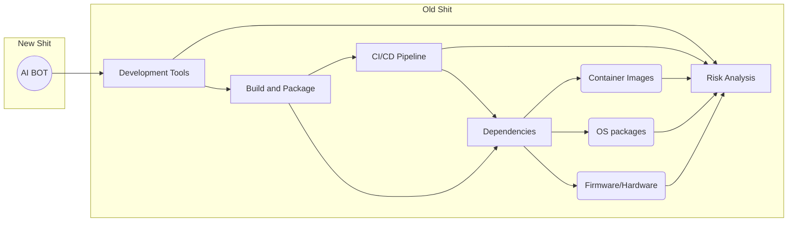

Este repositorio solo contiene este markdown con el material de referencia para una charla de seguridad en el desarrollo de software.

# Dependencias y seguridad: dónde está el riesgo.
## De qué va a tratar y no va a tratar esta charla

NO
* Hacking - acércate a tu sombrero ~~blanco gris~~ (NEGRO NO) ~~azul rojo~~ morado más cercano. 
* Cómo escribir código seguro - aprender a programar (**sin AI**), valida/sanitiza tus entradas y salidas ([CWE-707](https://cwe.mitre.org/data/definitions/707.html)), aprende cripto-GRAFÍA, usa OAuth2/SAML/PASSKEY, etc.
* ~~Linux, Windows, Docker, Kubernetes y todos los otros riesgos de la cadena de suministro donde corre tu código.~~

  * __Ahora si vamos a hablar de esas otras dependencias__
* Un pitch de ventas de alguna herramienta en específico 

> *no me pagan lo suficiente*

SI
* Cadena de suministro del software - DEPENDENCY HELL
* Cadena de suministro de la infraestructura tecnológica
* Análisis de riesgos - entiende mejor tus dependencias* 
* Riesgos externos - no todo es culpa de tus devs/sysadmin/IT crowd...bueno sí

## Qué es la cadena de suministro

Si somos obreros de software, la cadena de suministro son las máquinas que nos dan, las herramientas de trabajo y materiales de construcción para el producto final.
a.k.a. Todo lo que no haces tú (donde tú eres quien hace software).
Esto incluye:
* Herramientas de desarrollo (IDE, compiladores, linters)
* Construcción y empaquetado (Maven, Gradle, npm, pip)
* Pipeline de CI/CD (Jenkins, GitHub Actions, GitLab CI)
* Dependencias de código (librerías, frameworks, módulos)
* Dependencias de Sistema Operativo (sistema, imágenes, paquetes, parches, firmware)
* _--inserte aquí nombre de IA de moda--_

### Ejemplo A: Repositorios de dependencias de código
* Java : [Maven Central](https://mvnrepository.com/repos/central),[mvn download stats](https://dev.to/khmarbaise/analysing-download-statistics-for-apache-maven-3o4o),[top maven packages](https://mvnrepository.com/open-source),[maven vulns](https://security.snyk.io/vuln/maven)
* JavaScript: [npm](https://npmcharts.com/compare/lodash,debug,typescript), [ignore run-scripts](https://cheatsheetseries.owasp.org/cheatsheets/NPM_Security_Cheat_Sheet.html#3-minimize-attack-surfaces-by-ignoring-run-scripts)
* Python: [PyPI](https://pypistats.org/top)

#### Cómo construir árboles de dependencias
* [maven-dependency-plugin:tree](https://maven.apache.org/plugins/maven-dependency-plugin/tree-mojo.html)
* [npm ls --all](https://docs.npmjs.com/cli/v9/commands/npm-ls)
* [uv tree](https://docs.astral.sh/uv/getting-started/features/)

### Ejemplo B: Imágenes de contenedores
* [GitHub Container Registry 101](https://docs.github.com/es/packages/working-with-a-github-packages-registry/working-with-the-container-registry)
* [Docker Hub](https://hub.docker.com/search)

#### Cómo analizar layers (capas) de imágenes
* [dive image:tag](https://github.com/wagoodman/dive)
* [docker image history image:tag](https://docs.docker.com/reference/cli/docker/image/history/), [docker scout cves](https://docs.docker.com/scout/quickstart/)

## Explotando (muy literal) la cadena de suministro
El gobierno israelí infiltró la cadena de suministro de Hezbollah en 2024 en los beepers y posteriormente los walkie talkies de sus miembros.
- Interceptaron los lotes
- Agregaron explosivos
- Agregaron un switch para detonarlos

https://lieber.westpoint.edu/well-it-depends-explosive-pagers-attack-revisited/
> As it turns out, Israeli intelligence, operating through B.A.C., produced for Hezbollah specially designed pagers containing batteries laced with small quantities of the explosive PETN, which is difficult to detect. The explosives were designed to detonate after a specific encrypted message was sent to them, activating an on-switch in the explosive charge

## Explotando la cadena de suministro de software
Problema mundial: [OWASP TOP 10 A06:2021 – Vulnerable and Outdated Components](https://owasp.org/Top10/A06_2021-Vulnerable_and_Outdated_Components/).
   - Ya viene el OWASP Top 10 2025!, ¿se repetirá?

> [!IMPORTANT]
> Después de SolarWinds y Log4Shell, el gobierno de EEUU emite un [memo para mejorar la seguridad](https://www.whitehouse.gov/wp-content/uploads/2022/09/M-22-18.pdf) de la cadena de suministro de software.

[SolarWinds](https://www.techtarget.com/whatis/feature/SolarWinds-hack-explained-Everything-you-need-to-know): Inyectan malware en el binario de Orion, que sirve para monitorear redes, dando acceso a todo el tráfico de estas.

[Log4Shell](https://web.archive.org/web/20240616040703/https://www.lunasec.io/docs/blog/log4j-zero-day/
): Vulnerabilidad en Log4j, que se encontraba en todos lados en Java, que permitía ejecutar código en los logs.

### Inyectando malware en dependencias
Ejemplo: [xzutils](https://www.openwall.com/lists/oss-security/2024/03/29/4) es una pequeña librería para comprimir/descomprimir archivos zip. 
- La usa openssh como una dependencia para empaquetar bytes en una transmisión.
- __Por 3 años__ un grupo de usuarios maliciosos (¿espías?) tomaron el control del proyecto de xzutils en Github, reemplazando a los maintainer originales. *pura ingeniería social*
- Agregaron un backdoor en el release, no en el código fuente.
- Al ser una dependencia de openssh, todas las distros de Linux la incluyeron en sus propios paquetes de OpenSSH.
- Un desarrollador de PostgreSQL descubrió el backdoor y lo reportó a la comunidad *mientras hacía pruebas en una máquina Debian*.
  - Lo descubre porque ve una perturbación en la fuerza (CPU, errores)
- Se reporta el backdoor y todo mundo empieza a actualizar masivamente

#### Caso polyfill.io
[Polyfill.io](https://www.akamai.com/blog/security/2024-polyfill-supply-chain-attack-what-to-know) es un servicio que provee polyfills para navegadores antiguos.
- Un grupo de usuarios maliciosos tomó control del ~~proyecto~~ dominio y agrega un payload malicioso en cdn.polyfill.io.
- Esto hacía que cualquier página que usara polyfill.io para cargar polyfills en navegadores antiguos, ejecutara el payload malicioso.
- **La campaña estaba orientada a navegadores móviles con ciertas condiciones.**

### Typos en nombres de paquetes
Ataque súper común en npm, donde se crean paquetes con nombres similares a los populares, pero con errores de escritura.
1. Se crea un paquete con un nombre similar a uno popular e.g. `lodas`
2. Agregas un código malicioso que se ejecute en el paso de prepare, preinstall o postinstall
3. Se publica en npm (solo necesitas github y una cuenta de npm)
4. Se espera a que alguien lo instale en local o en un pipeline de CI/CD
5. ¡PUM!
Regularmente son parte de campañas más grandes apuntando a una organización o tratando de minar criptos globalmente.
https://blog.phylum.io/phylum-detects-active-typosquatting-campaign-targeting-npm-developers/

https://thehackernews.com/2024/07/malicious-npm-packages-found-using.html

https://secure.software/npm/packages/legacyreact-aws-s3-typescript?_gl=1*12z9qd5*_gcl_au*MTc5Nzc2Njg5OS4xNzI3MzMxMzU5

https://github.com/cncf/tag-security/blob/dca894ee62ce4c37109325a3c381b49071a7d52e/community/catalog/compromises/2022/node-ipc-peacenotwar.md

https://github.com/advisories?query=type%3Amalware
- El pan de cada día en npm :-P

### Explotando vulnerabilidades conocidas (CVE)
https://nvd.nist.gov/general/nvd-dashboard, https://www.cvedetails.com/
**Todas las aplicaciones tienen una vulnerabilidad o la van a tener**
#### Mito: El código OpenSource NO es más seguro
*PERO* hay más ojos revisando el código y todos lo usamos 

**=> buena motivación para encontrar y resolver vulnerabilidades.**

> [!NOTE]
> En el continente americano, las vulnerabilidades en el OpenSource son reportadas por *alguien* a una CNA (CVE Numbering Authority) que les asigna un número CVE.
Las CNA las evalúan y comparten la información a la NVD (National Vulnerability Database) que las publica.
Las herramientas de seguridad las integran para poder escanear y reportar vulnerabilidades en tu código.
Esto puede tardar días, semanas o meses o años....
En todo ese tiempo, tu código sigue siendo vulnerable.

* La Unión Europea luego que el gobierno de Estados Unidos casi deja sin recursos al MITRE (el organismo que mantiene la NVD) crea su propia base de datos https://euvd.enisa.europa.eu/faq

#### Mito: Las vulnerabilidades son fáciles de explotar
https://www.mandiant.com/sites/default/files/2021-09/rpt-java-vulnerabilities.pdf

Hay muchas condiciones que se deben cumplir para explotar una vulnerabilidad en una dependencia.
1. Tener la versión vulnerable al momento de ejecución
2. Que tu código acceda de forma directa (DIRECT DEPENDENCY) o indirecta (TRANSITIVE DEPENDENCY) a la vulnerabilidad
3. Que la vulnerabilidad sea explotable en el contexto de la ejecución de tu código Ó 
    1. que la biblioteca vulnerable puede ser expuesta a una ejecución fuera del contexto de tu código 
    > (p.ej. una Web UI que se levante como parte de un runtime).

### Ejemplo: Spring4Shell
https://github.com/denniskniep/Spring4Shell-vulnerable-app/blob/master/src/main/java/com/reznok/helloworld/HelloController.java
https://github.com/BobTheShoplifter/Spring4Shell-POC

Spring en su versión menor a 5.3.18 y 5.2.20 tiene una vulnerabilidad que permite ejecutar código en el servidor si expones un Controller que utiliza ModelAttribute corriendo desde un WAR sobre Tomcat en Java 9

### Infectando sistema de integración continua
_Esto no es nuevo_. Ken Thompson, co-inventor de Unix, creó un [backdoor en el compilador de C de Unix en 1984](https://wiki.c2.com/?TheKenThompsonHack). Este inyectaba un troyano en cualquier programa que compilaba, incluyendo el compilador mismo.
Esto demostró que era posible inyectar malware en la cadena de suministro de software y que era muy difícil de detectar.

##### Plugins de Jenkins
> “We strive to fix all security vulnerabilities in Jenkins and plugins in a timely manner. However, the structure of the Jenkins project, which gives plugin maintainers a lot of autonomy, and the number and diversity of plugins make this impossible to guarantee.” - Handling Vulnerabilities in Plugins

Es posible que algún plugin que estés utilizando pueda contener malware que se ejecute en tu servidor de Jenkins y que tenga acceso a tus repositorios, credenciales y demás información sensible.
https://www.legitsecurity.com/blog/how-to-continuously-detect-vulnerable-jenkins-plugins-to-avoid-a-software-supply-chain-attack

##### GitHub Actions
https://cycode.com/blog/github-actions-vulnerabilities/
Los GitHub Actions son de código abierto, pero no hay garantía de lo que van a hacer o si pueden descargar payload maliciosos durante su ejecución.

#### Herramientas que instalan herramientas
Porque todo dev necesita su terminal para programar *y no hay nada más seguro que el dominio de un tutorial como __macostutorial.com/iterm2/install.sh__ que te aparece en los ads de una búsqueda (pssst... es malware).

https://hybrid-analysis.com/sample/246abf482a252f27ad2dccaad24b52a8597efcfd2ad0f06dc83bab9ddca13d2f/6862467d419f4a2424068f52
> *Propaganda auspiciada por [Scattered Spider](https://fight.mitre.org/groups/FGG5004)*

O, cuando [hackean a tu proovedor de seguridad](https://www.nightfall.ai/blog/heres-what-we-can-learn-from-the-cyberhaven-incident) instalando malware en tu extensión oficial de código
> Here’s how the attack unfolded.
> * A phishing email, disguised as official communication from Google Chrome Web Store Developer Support, claimed that Cyberhaven's extension violated policies and was at risk of removal.
> * The email directed the recipient to a malicious OAuth application named "Privacy Policy Extension," which mimicked Google's authentication process.
> * By granting permissions to this application, the attackers gained control of Cyberhaven's Chrome Web Store account.
> * Using this access, they uploaded a malicious version (v24.10.4) of Cyberhaven's browser extension. This version included code to exfiltrate cookies, session tokens, and other sensitive data from users[1][2][4].
> * **The malicious extension passed Chrome Web Store's security review.**

### La IA es insegura
Pero bien bien bien insegura...y es lo que ya todos vamos a usar para crear más software en lo que _El Arquitecto_ termina la Matrix.

| IA | Cómo se usa | Riesgo | Ejemplo |
| - | - | - | -|
|Asistente de código| Escribe código por ti o contigo. Rubber Ducky| Está entrenado por el código más inseguro del mundo EL DE TODOS | [vulnerable code 40% of time](https://cyber.nyu.edu/2021/10/15/ccs-researchers-find-github-copilot-generates-vulnerable-code-40-of-the-time/), [Replicate vulnerable code](https://labs.snyk.io/resources/copilot-amplifies-insecure-codebases-by-replicating-vulnerabilities/) |
|MCP Server, GPT| Bot entrenado en un cierto dominio para responder mejor|Respuestas erróneas, _Model Poisoning_, _Broken AuthZ_, _Data Exfill_, *hasta RCE* | [MCP nightmare](https://equixly.com/blog/2025/03/29/mcp-server-new-security-nightmare/),[mcp-remote RCE](https://thehackernews.com/2025/07/critical-mcp-remote-vulnerability.html)|
|Bot conversacional|Le preguntas (prompt) y da respuestas |[Cubiertos en LLM Top 10](https://genai.owasp.org/llm-top-10/)|**[AI package hallucinations](https://www.lasso.security/blog/ai-package-hallucinations) esto está súper chido**|
|Agente de AI|Hace todo el trabajo de una tarea especializada|Alucinaciones, Data Leaks, Errores de operación, security bypass, **no user/system space...esto es importante** |[Cheating M365 Copilot](https://i.blackhat.com/BH-US-24/Presentations/US24-MichaelBargury-LivingoffMicrosofCopilot.pdf),[Blind spots in Security Strategy](https://www.appsecengineer.com/blog/5-reasons-ai-agents-are-a-blind-spot-in-your-security-strategy)|

> [!IMPORTANT]
> 
> **TODOS TUS PROVEEDORES DE HARDWARE, CLOUD Y SAAS TAMBIÉN SON PARTE DE TU CADENA DE SUMINISTRO**
> 
> ---
> 

## Cómo prevenir riesgos a la cadena de suministro
Tu software es inseguro ACEPTALO.
Pero, no todo está perdido...
### No usar dependencias
La mejor manera de no tener vulnerabilidades es no tener dependencias ajenas (sea código, software externo, LLM's o lo que sea).

Si puedes confiar en que puedes hacer un mejor trabajo que los demás contribuidores del mundo, adelante.
__Esto parece es lo que busca go con su filosofía de "baterías no incluidas".__

### Análisis de dependencias de código (Software Composition Analysis)
El análisis de dependencias es una técnica que te permite saber qué dependencias estás utilizando, qué versiones son y si tienen vulnerabilidades conocidas.
Existen múltiples herramientas que hacen el análisis de forma automágica:

--ANUNCIO DE VENDORS EN 3, 2, 1--
* [Snyk](https://snyk.io/)
* [Nexus Sonatype](https://oss.sonatype.org/)
* [JFrog Xray](https://jfrog.com/xray/)
* [Mend / Renovatebot](https://docs.renovatebot.com/)
* Veracode
* [OWASP Dependency-Check](https://owasp.org/www-project-dependency-check/)
* BlackDuck
* Gitlab Dependency Scanning
* [Github Dependency Graph/Dependabot](https://github.com/dependabot), [dependencias soportadas](https://docs.github.com/es/code-security/dependabot/ecosystems-supported-by-dependabot/supported-ecosystems-and-repositories)
* [Semgrep](https://semgrep.dev/docs/semgrep-supply-chain/getting-started)
* [Trivy](https://aquasecurity.github.io/trivy/v0.55/docs/target/sbom/)

Para hacer este análisis se necesita un archivo con las versiones "congeladas" de las mismas (a.k.a. lockfile) y una base de datos con vulnerabilidades.

### Software Bill of Materials (SBOM)
Archivo que muestra todas las dependencias de tu proyecto, sus versiones y sus licencias.

https://github.blog/enterprise-software/governance-and-compliance/introducing-self-service-sboms/

Esta fue la solución que el gobierno de USA aceptó como "formal" para resolver el problema de la cadena de suministro de software.
Existen múltiples formatos:
* CycloneDX
* SPDX
* SWID - aceptado por el NTIA(USA)
Múltiples herramientas pueden generar un SBOM a partir de la construcción de tu proyecto o el análisis de tus dependencias.

*Nota: No es suficiente con tener un SBOM, también necesitas un proceso para revisarlo y actuar en consecuencia.*

El principal objetivo de los SBOM es poder rastrear y auditar las dependencias de tu proyecto, para poder actuar en caso de una vulnerabilidad o hacer un mejor análisis posterior a un incidente.

### Security Scorecards por OpenSSF
Ok, los tacos con cochi son muy buenos, pero no son lo mejor para tu salud.
El gobierno de México y Estados Unidos tienen inspectores de comida en restaurantes para que no mueras.

La OpenSource Security Foundation (OpenSSF) tiene un proyecto llamado Security Scorecards que revisa la seguridad de los proyectos de OpenSource y les asigna una calificación en base a distintas métricas.

https://openssf.org/projects/scorecard/
https://scorecard.dev/
https://securityscorecards.dev/viewer/?uri=github.com%2Flodash%2Flodash

### Repositorios privados de dependencias
Los repositorios privados proveen defensa a profundidad, es decir crean un perímetro que te protege de:
* No exponer tus librerías internas
* Analizar las dependencias que tus proyectos usan, en local o CI
* Tener un control de versiones de las dependencias que usas
* Tener un control de acceso a las dependencias que usas

### Actualización automática de código
Actualizar de Java 8 a Java 21 te va a doler, pero de Java 17 a Java 21 no tanto.
Lo mismo pasa con las dependencias, entre más actualizadas estén, menos vulnerabilidades tendrán.
Para eso es posible usar herramientas que hacen el "mejor esfuerzo" por mantener tus dependencias actualizadas.
Ejemplos:
* Dependabot
* Renovatebot
* Dependency-Track

### Actualizaciones automáticas de Sistema Operativo

### Imágenes de Contenedores __hardenizadas__

### Monitoreo y __Secureguardrails__ de LLM's
Oh...no uses bots :P

### 

# Gracias
@heryxpc
